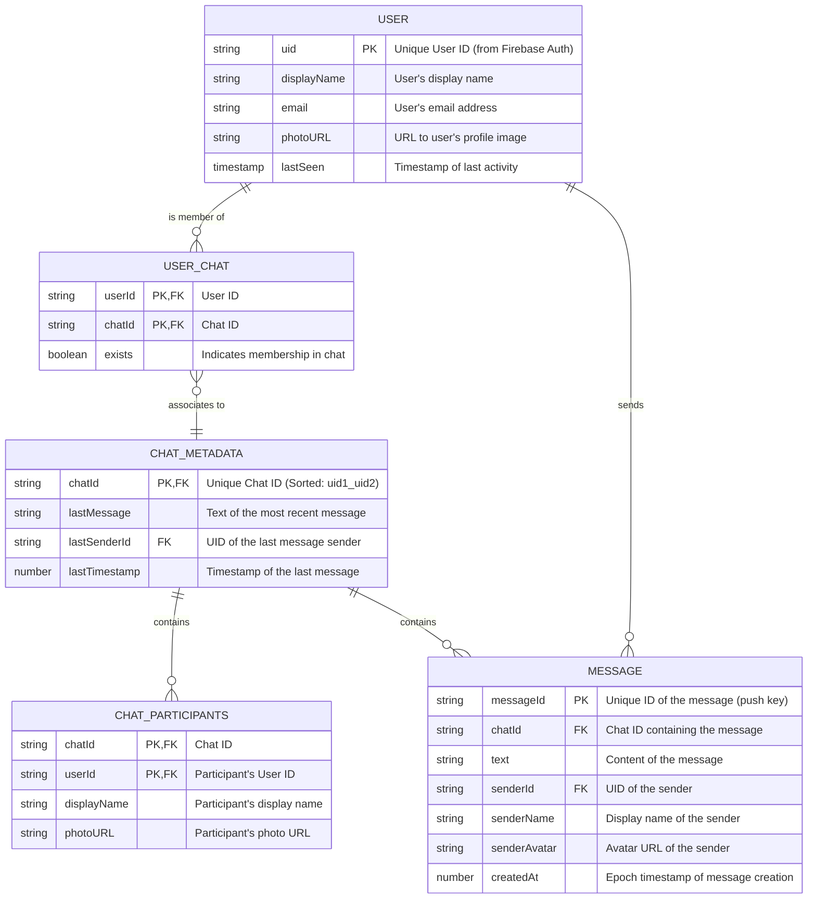

# WhatsApp Clone - App Design & Database Architecture

A real-time, responsive WhatsApp Clone built using React, Material UI (MUI), Redux Toolkit, and Firebase (Auth, Firestore, and Realtime Database).

---

## 1. Application Design Overview

The application is structured around a standard React architecture separated into clean, modular layers:

- **State Management (Redux Toolkit)**: Uses `store.js` as the central state provider with two main slices:
  - `authSlice.js`: Manages user authentication states (`user`, `isAuthenticated`, and `loading` sign-in states).
  - `chatSlice.js`: Manages active conversations, messages list, list of registered users, and active chat window references.
- **Service Layer (Firebase SDK v9)**: Separates database operations into pure functions:
  - `authService.js`: Integrates Google Sign-In popups and monitors session state change listeners (`onAuthStateChanged`).
  - `chatService.js`: Handles real-time message broadcasting, metadata indexing, and user list subscriptions using fully reactive listeners (`onSnapshot` and `onValue`).
- **Presentation Layer (Material UI)**: Curated dark-themed layout with responsive sidebar user search, rounded pill input fields, emoji/plus/voice attachments, and a dynamic scrolling message interface.

---

## 2. Entity-Relationship (ER) Diagram

The following diagram illustrates how user profiles (Firestore) and private chat metadata, messages, and membership indexes (Realtime Database) relate to each other:



---

## 3. How the Three Database Structures Work

The app splits data between **Firestore** (for user registry query performance) and **Realtime Database** (for low-latency real-time chat messages and indicators):

### A. Users Table (`users` Collection in Firestore)
- **Role**: Serves as the global registration directory of all people using the app.
- **Design**: Pushes profiles during authentication:
  - Document ID is the `uid` of the authenticated user.
  - Subscribes reactively via `onSnapshot` to render a list of other users to start chatting with.

### B. Chat Table (`chats` in Realtime Database)
- **Role**: Stores actual chat rooms, message histories, and the status of active conversations.
- **Design**: Uses a deterministic compound key for room IDs (`chatId`), generated by lexicographically sorting and joining the two participant UIDs (`[uid1, uid2].sort().join("_")`). This ensures both users map to the exact same room ID without duplicate collections.
- **Structure**:
  - `chats/{chatId}/metadata`: Stores participant information, user avatars, and the `lastMessage` text + `lastTimestamp` number to display on sidebar threads without loading the entire message history.
  - `chats/{chatId}/messages/{messageId}`: Holds individual text messages under RTDB push-keys, containing the sender details and creation time sorted reactively by the client.

### C. Message/Membership Table (`userChats` in Realtime Database)
- **Role**: Serves as a fast membership index to fetch active conversations belonging to a user.
- **Design**: Pushed under `userChats/{userId}/{chatId} = true`.
  - When User A sends a message to User B, it updates `userChats/UserA/chatId = true` and `userChats/UserB/chatId = true`.
  - The sidebar uses a listener on `userChats/currentUserId` to dynamically subscribe only to the active metadata of chats that the current user belongs to, preventing unnecessary database reads.

---

## 4. Security Rules Architecture

To protect user conversations without adding complex backends, the app enforces a substring-matching Security Rules architecture:

```json
{
  "rules": {
    "chats": {
      "$chatId": {
        ".read": "auth != null && $chatId.contains(auth.uid)",
        ".write": "auth != null && $chatId.contains(auth.uid)"
      }
    },
    "userChats": {
      "$uid": {
        ".read": "auth != null && auth.uid === $uid",
        "$chatId": {
          ".write": "auth != null && (auth.uid === $uid || $chatId.contains(auth.uid))"
        }
      }
    }
  }
}
```

1. **Private Chat Access (`chats`)**: Only users whose UIDs are part of the sorted `$chatId` string can read or write inside that chat.
2. **Inbox Membership (`userChats`)**: A user can write to another user's inbox index to notify them of a new message **only if** they are a participant of the associated chat (`$chatId.contains(auth.uid)`).
